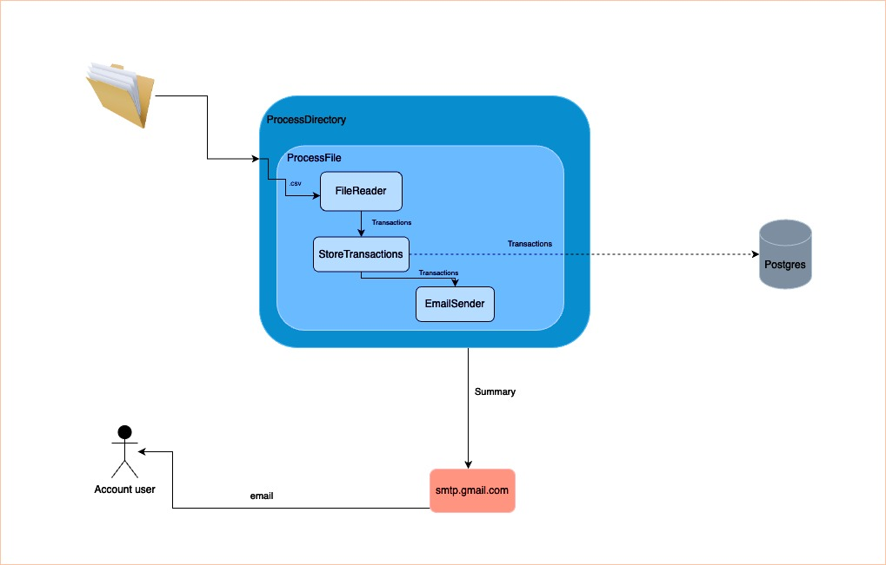

# Stori - Transaction CSV Processorçç!


A system that processes a file from a mounted directory and sends summary information to a user in the form of an email.

## Clean Architecture

The architecture is based on the concept of Clean Architecture. Clean Architecture is a software design principle to create a clear separation between different components of an application. This structure enhances maintainability, testability, and scalability by defining clear boundaries between layers. Organizing the code into distinct layers ensures that the business logic remains independent of external frameworks or infrastructure. This approach allows for easy adaptability to new requirements, facilitates testing, and promotes a clear structure that enhances collaboration and code readability

The architecture consists of four main layers:

- Entities: Core business logic and data structures.
- Use Cases: Defines the application’s specific business rules and the interactions between entities.
- Adapters: Interfaces to external systems and tools.
- Frameworks: Handles external dependencies and integrations.

### Architecture diagram


## Local flow

### How to run the application

This project uses Docker Compose to manage the necessary services (PostgreSQL, migrations, and the application). To run the project locally, follow the steps below.

- In the docker-compose.yml file, the application service (app) has a volume mounted to a specific local path:
```
volumes:
  - /Users/rodrigonoblega/Repositories/stori/path:/path
```
This path corresponds to the local directory where you store files for processing. You might need to change this to the appropriate path for your machine.
To update open the docker-compose.yml file and change the path to the one that matches your local directory structure. For example:
  ```
volumes:
  - /your/local/directory:/path
  ```

You can run the app locally with Docker executing

```docker compose up --build ```

This command will:
- Start a PostgreSQL locally in the port 5432
- Make all the migration process using the files in /migrations
- Start the Stori application locally

In the local environment, the application is designed to continuously monitor a specified directory for new .csv files. This process consists of two main behaviors:

- Initial Directory Scan:
  - When the application starts, it immediately scans the specified directory for existing .csv files.
  - If any .csv files are found, the application processes them as part of the startup routine.
  - The transactions are stored in a postgres database inside the container
  - The transaction summary emails is sent by smtp.gmail.com service.

[Watch the demo](https://www.loom.com/share/4b8f3bd4b2a34413bc453aeaace937f5)



- Continuous Monitoring
  - After the initial scan, the application keeps watching the directory for any new .csv files added in real-time.
  - When a new file is detected, it triggers the processing pipeline to handle the file.
  - The transactions are stored in a postgres database inside the container
  - The transaction summary emails are sent by smtp.gmail.com service.


[Watch the demo](https://www.loom.com/share/8cbe21072b8248cabcb0d809fd9e57ab)

This approach ensures that files added both before and after the application starts are processed seamlessly.

## Prod flow

In the production environment, the architecture leverages AWS cloud services to efficiently handle file uploads and processing. The flow is event-driven, with the following sequence:

- File Upload to S3 Bucket
    - When a .csv file is uploaded to a specific S3 bucket, it triggers an event notification.
  
- AWS Lambda Execution
    - The event notification invokes an AWS Lambda function, where the core processing logic of the application is deployed.
    - The Lambda function retrieves the uploaded .csv file from the S3 bucket and processes it as part of the pipeline.
    - The transactions are stored in a AWS RDS postgres database
    - The transaction summary emails are sent by AWS SES


[Watch the demo](https://www.loom.com/share/0709901cfb1f47e7bf1e803e8ee3584f) 

## External Libraries Used

- fsnotify: Used to watch for file system changes. In the local environment, it monitors a directory for new .csv files to process.
- viper: Provides configuration management. It reads configuration from environment variables or configuration files.
- gorm.io/gorm: An ORM (Object-Relational Mapping) library for Go.
- go.gorm/postgres: PostgreSQL database driver for GORM
- testify: Provides assertions and mocking capabilities for unit testing
- aws-sdk-go: AWS SDK for Go. It is used to interact with AWS services.

## Assumptions
- Account ID Exists in the Database: The Account ID provided in the CSV file already exists in the database.
- One CSV File per Account: Each CSV file corresponds to only one Account ID.


## Testing strategy

The testing focused on the use cases and entity layers to ensure the system's core functionality worked as expected. These layers encapsulate the project's business logic, which is critical for processing transactions, generating summaries, and sending email reports.

- Entities Layer: Testing verifies the behavior of domain entities and their compliance with business rules.
- Use Cases Layer: Tests validate the proper orchestration of business processes, ensuring that the system performs its expected actions under various scenarios.

### How to run tests

```go test ./... -coverpkg=./... -coverprofile=coverage.out```

```go tool cover -html=coverage.out```

These commands will generate a coverage report highlighting that the entities and use cases layers have a high percentage of their lines covered by tests.


## Questions

* [rnoblega@gmail.com](rnoblega@gmail.com)


